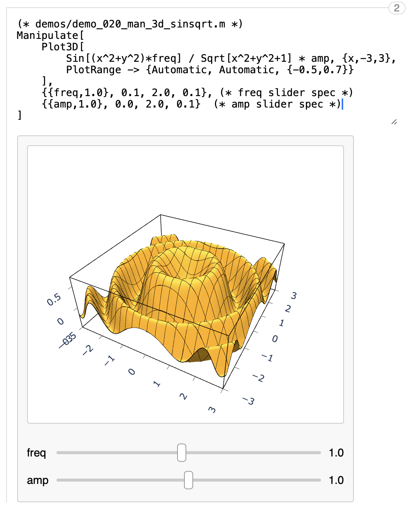
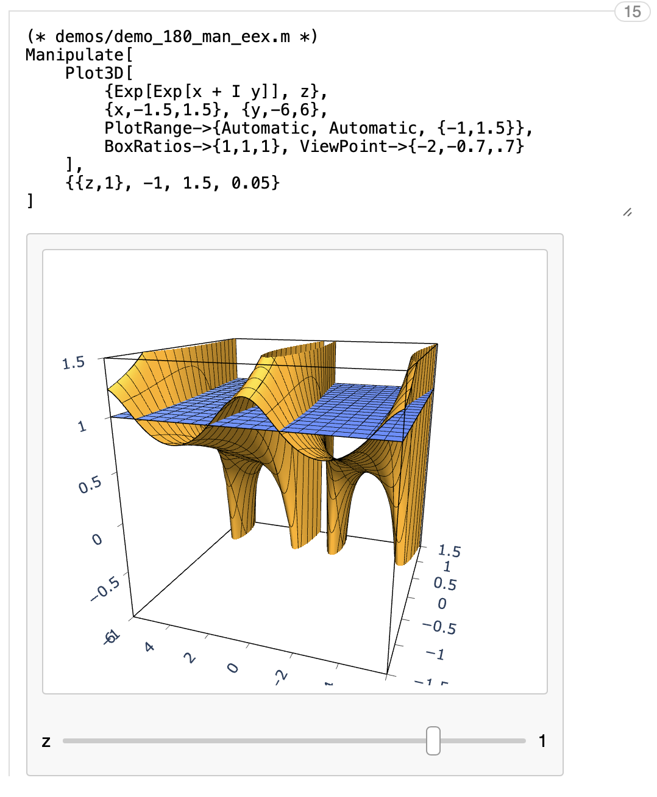

  

Following instructions assume you have installed a development version of Mathics3, including all relevant PRs.
If installing pywebview fails, the demo should still run, displaying its output in your system web browser instead
of in a dedicated pop-up window.
If the plots are gray you may not have the relevant code and PRs from Mathics3 installed.
    
    git clone https://github.com/bdlucas1/mathics-demo
    cd mathics-demo
    pip install -r requirements.txt
    python fe_browser.py demos/demo_*.m
